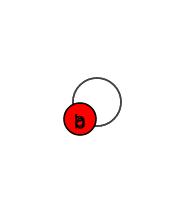
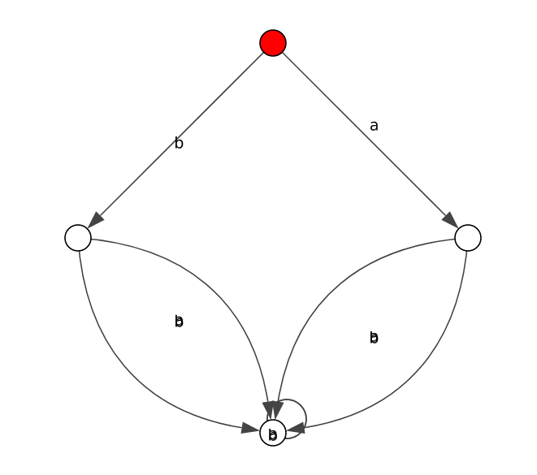
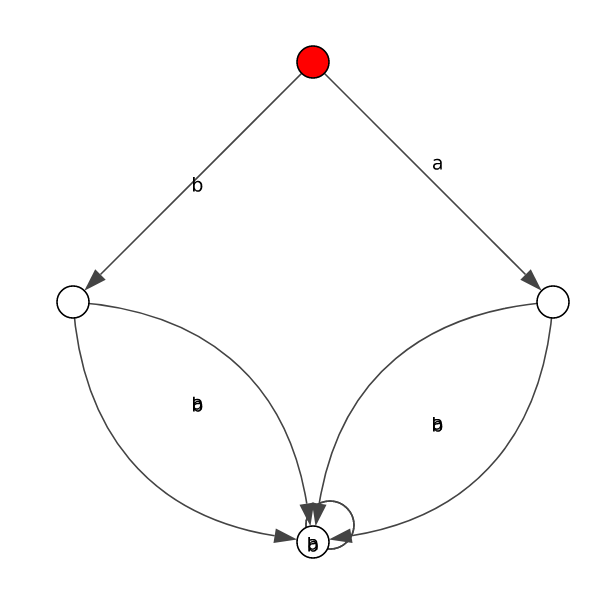
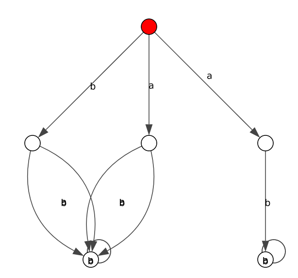
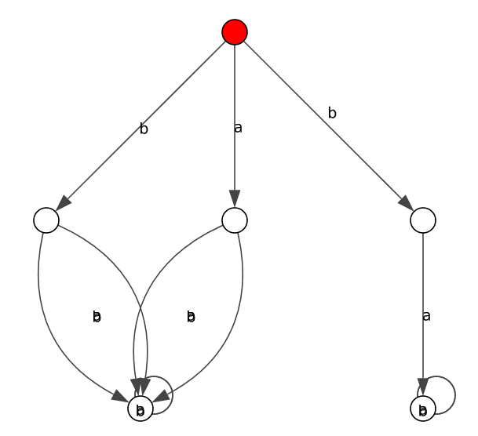

# HML Synthesis of Distinguished Graphs

This is a tool for synthesising an input graph with an input HML formula so that the results are distinguished by that formula.

To get started download this repository and then follow these steps:
## Import Library
[Python igraph](https://igraph.org/python/)

## Input
The relevant functions take an HML formula and optionally a graph as input:
The HML formula needs to be a string of the following pattern as input:
```
FORMULA =   CONST | UNARY | ’(’ BINARY ’)’
CONST =     ’true’ | ’false’
UNARY =     ’<’ ([a-z]|[A-Z]|[0-9])+ ’>’ FORMULA |
            ’[’ ([a-z]|[A-Z]|[0-9])+ ’]’ FORMULA
BINARY =    FORMULA ’and’ FORMULA | FORMULA ’or’ FORMULA
```

The parentheses are important.

The input graph can be left empty, then the file `default_graph` is used. Otherwise it takes the filename of the file where the graph is safed in [GraphML format](http://graphml.graphdrawing.org/) as a string. 
There are a also couple of given example files in the folder "input_files". All extra input graph files must be added to that folder. It is just the filename as input, no path.

## Function call
In case you want just the resulting graphs call the function `generate_distinguished_graphs(formula_str, graph_filename)`. You will get two lists as results: they are lists of graphs of the type [igraph.Graph](https://igraph.org/python/). If accessing `graph["initial"]` of any of the graphs in the first list you will get the id of the initial node, which is the process that satisfies the input HML formula. The initial node of each graph in the second list of the formula does not satisfy the input HML formula.

In case you are more curious about the steps in between you can call `generate_distinguished_graphs_testing(formula_str, graph_filename)` and you will get the input graph, the unfolded form of that input graph, the input formula and it's negated form as String objects and the two previously mentioned lists of graphs. All graph are of the type igraph.Graph.

Both functions can be found in `main.py`.

## Visualization
The igraph library provides a lot of option for layout, simple plotting and export into a lot of different file formats [here](https://igraph.org/python/tutorial/latest/tutorial.html#layouts-and-plotting). 
Sadly it does not offer the option of being able to move edge labels so that they don't overlap. Therefore I would suggest exporting the graphs as files and then plotting them using a trusted plotting library.

## Example
### Imports and setup of layout
```
from main import generate_distinguished_graphs_testing
from igraph import *

visual_style = {}
visual_style["bbox"] = (400,400)
visual_style["margin"] = 50
visual_style["vertex_size"] = 20
``` 
### Function call
```
input_graph, unfolded_graph, formula, negated_formula, satisfying_results, non_satisfying_results = generate_distinguished_graphs_testing("([b]<b>true or <a>[a]false)","synthesis_example_general_3")
```

### Plotting of input graph
```
my_layout = input_graph.layout_sugiyama(layers=None, weights=None, hgap=1, vgap=1, maxiter=100, return_extended_graph=False)
visual_style["layout"] = my_layout
plot(input_graph, **visual_style)
```


### Plotting of unfolded graph
```
my_layout = unfolded_graph.layout_sugiyama(layers=None, weights=None, hgap=1, vgap=1, maxiter=100, return_extended_graph=False)
visual_style["layout"] = my_layout
plot(unfolded_graph, **visual_style)
```


### Input formula
```
print(formula)
```
Output:
```
([b]<b>true or <a>[a]false)
```

### Satisfying results
```
for result in satisfying_results:
    my_layout = result.layout_sugiyama(layers=None, weights=None, hgap=1, vgap=1, maxiter=100, return_extended_graph=False)
    visual_style["layout"] = my_layout
    plot(result, **visual_style)
```



### Negated input formula
```
print(negated_formula)
```
Output:
```
(<b>[b]false and [a]<a>true)
```

### Non-satisfying result
```
for result in non_satisfying_results:
    my_layout = result.layout_sugiyama(layers=None, weights=None, hgap=1, vgap=1, maxiter=100, return_extended_graph=False)
    visual_style["layout"] = my_layout
    plot(result, **visual_style)
```
